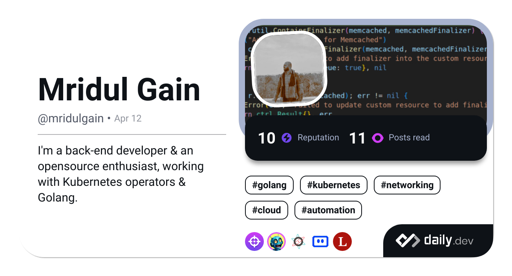

<!-- **mridulgain/mridulgain** is a ✨ _special_ ✨ repository because its `README.md` (this file) appears on your GitHub profile.

Here are some ideas to get you started: 

<h1 align="center">Hi 👋, I'm Mridul</h1>
<h5 align="center">A passionate backend developer & an opensource enthusiast</h5>
-->

  

   

<ul>
    <li>
     Software Enginner at <a href="https://avesha.io/">Avesha</a>
    </li>
    <li>
     I’m currently working on <a href="https://github.com/kubeslice">Kubeslice</a>
    </li>
    <li>
     Learning Kubernetes custom operator development, networking & Golang
    </li>
    <li>
    🇮🇳 I'm from India
    </li>
</ul>
<!-- - 📫 How to reach me: ... 
- 🔭 I’m currently working on 
- 🌱 Currently learning Kubernetes operator development, networking & Golang
- 🇮🇳 I'm from India
- 💬 Ask me about anything!
- 👯 I’m looking to collaborate on any cool project
- 🤔 I’m looking for help with understanding k8s controller design patterns
- 😄 Pronouns: ...
- ⚡ Fun fact: ... --->

<h2 align="center">🧰 Tech stack 🛠️</h2>

  

<h2 align="center">📊 Github Stats 📈</h2>

<!-- 

 -->

<a href="#">
    
     
    
     
     </a>

<!--

&nbsp;

<h2 align="center"> 🏆 Github Trophies 🏆 </h2> 

<h2 align="center">🎫 My Sticker Collection! 🎫</h2>

-->

<!-- ## Other contributions -->

<!--  -->

<!-- 

    
    
     

 -->

<!--  -->
